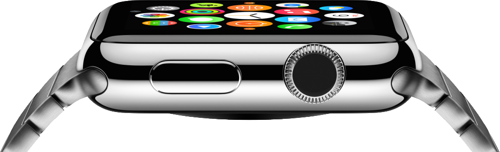
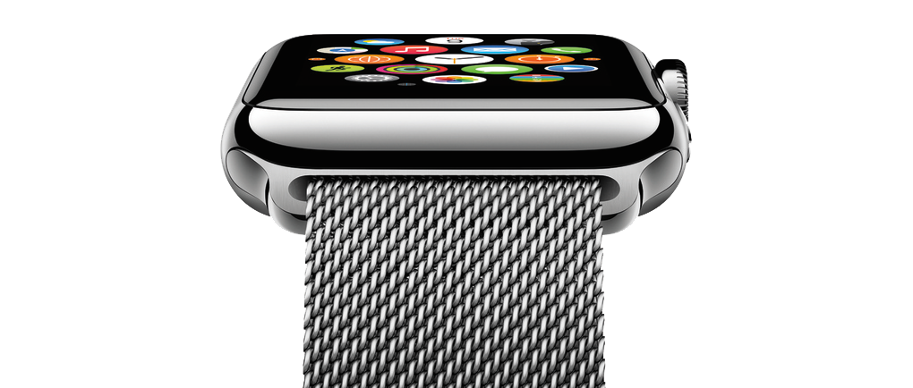

## 1. How It’s Positioned
To begin with, there is something really fundamental we need to comprehend about Apple Watch. Apple pays absolute attention not to position the Apple watch neither as a smartwatch as we geekily accept as a new product category, nor a true time piece that would embrace the decades of storytelling and move from generation to generation. If the quintessential marketing videos of Jony Ive tell us anything, it’s a fashion statement that is focused on helping individuals to express themselves through how they customise their Apple Watches. Mind you, according to Apple, there are more than 2 million unique configurations that involves different body sizes, colours, straps and watch faces.

The vast amount of personalisation makes it clear that Apple wants their Watch not to be affiliated with tech nerds or über riches, but instead the everyday people who wants a fun experience. So what does ‘fun’ stand for? Fun brands are often in convergence with affordable price with high emotional attachment. It represents the youth who wants the style without long-term commitment. The infamous Swiss producer Swatch falls exactly under this category, with entry-level pricing and variety of options in design. Looking from this point of view, the hugely disappointing price tag of $350 makes more sense. It’s not exactly a Patek Philippe to look after for generations, but a piece of style that does and will need to be updated every now and then. Which brings me to Product Life Cycle for Apple Watch.

Apple famously refreshes and updates their product lines annually, which makes sense considering the fast paced competition in their respective industries of computers, smartphones and tablets. When it comes to watches, on the other hand, I am rather left sceptical on the developments to follow. Because after all, at least at this stage of product category, smart watches are seen as a novelty that would attract mainly the people who feel like they have to keep up with technology. And even so, they wouldn’t spare their budget to refresh a time-peace every year. My prediction is that a two-year refreshment cycle would be more befitting with the nature of this new product category.

## 2. The Design Clues
The transformation of our everyday things into a digital interface takes a lot of pain to ease customers into trying. The answer of this problem in touchscreen smartphones was to induce skeuomorphism, adapting the interface to carry out clues of real-life objects like a calendar page or Braun-style calculator. Smart watches, despite the great thrust in technology, so far fell short of providing that essential cue to familiarise this brand new interface for traditional watch wearers.

Apple Watch is fully touch optimised that senses the differences in pressure to react the interface accordingly, but the digital crown catches the crucial bit of relating the product with a traditional time piece. Again, without a digital crown, Apple Watch could still function in interface with the use of other digital technologies, but the inclusion of that redundant control mechanism, along with analog time faces, give in to creating the elusion of a traditional watch. These details hinting the user of the traditional timekeeping, although mostly insignificant, would definitely influence the overall experience of expanding the product target audience beyond tech enthusiasts.

## 3. What’s Wrong With Apple Watch
First of all, if history has taught us anything, Apple’s first attempts at each new product category will stall in catching the true adoption and fail at few technical aspects. The biggest obstacles and question marks in Apple Watch seems to be whether anybody actually needs a smart watch to begin with. This doesn’t mean to stand against the probable success of Apple Watch in sales. If anything, it will make Apple the first trillion dollar company with its emotional design that makes logical thinking redundant when customers give it a try. But as I said, at least the product category potentially settles down with new developments in the future, we will see the true meaning of it.

Another point to make here is the technical lackings of Apple Watch. Like, does it really need an iPhone to even set up or what about the battery life? Second iterations will surely perform better, but for now, many people’s understanding is that the wearable tech is being forced on to us rather than essentially plugging a need in our lives. However, I should quote Henry Ford here, “If I had asked people what they wanted, they would have said faster horses”.

*"As it stands now, the appeal of the Apple Watch more closely resembles the niche Apple TV than it does the ubiquitous iPod. Undoubtedly, second and third generation products will be slimmer, and have longer battery life, but anything short of a major technological breakthrough won’t be compelling enough from a functional or aesthetic point of view to drive smartwatches into the mainstream."*
[from FastCo Design](https://www.fastcodesign.com/3035611/apples-watch-wont-replace-a-rolex)

All in all, the overall opinion towards wearables today is that it still remains as a niche to embrace the whole revolutionary approach we saw back with smartphones or iPods. However, I’m optimistic that the whole wearable industry will awaken into taking a central part in our lives that feels as essential as telling time. Again, ‘time’ will tell.

<iframe src='https://gfycat.com/ifr/UncommonPerfumedGermanshepherd' frameborder='0' scrolling='no' allowfullscreen width='640' height='405'></iframe>

