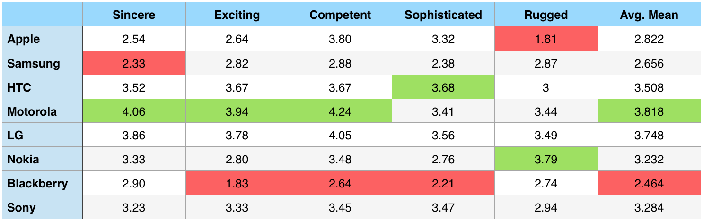

With great relief from good riddance of a dissertation, I can’t help but feel obliged to share my findings. After all, this was a project that took way more involvement from the internet to declare it as a singular act of pride and hard work. For this, I massively thank the online communities, most specifically [Reddit](https://reddit.com/), for all the great help they’ve provided.

In response to my fears of not even passing through 100 respondents, they welcomed my cry for aid and helped me pass 4000 respondents. A special ‘thank you’ also goes to those who apparently use ‘Poop’ branded smartphones. I can’t help but think that they took the survey on the crapper. I know, we’ve all done it.

Here, I will not go into much as I did in my massive 80 page paper. I imagine that a small commentary along with basic graph of the results would suffice.

**Disclaimer**: The people who know me or the ones who at least gave a brief look at my blog would imagine the monster of an Apple fanboyism that lies beneath me. I assure you, though, that this quantitative research focused nothing more than raw numbers you provided me; which left me little to no space for individual expression.

**Problems in Data**: Firstly, the data that came from Blackberry users was not considered to be reliable, due to low attendance (10 people/0.2%) from them. Secondly, the initial survey draft did not include the ‘once in 2 years’ option in the question about the upgrade cycles. This was solely because of my stupidity, but I fixed it as soon as I was notified of it. Finally, in the individual brand personality measures part of the first survey draft, Sony and Nexus was forgotten. Again, I fixed these as soon as I realised.

## Who Took The Survey

Of total respondents of 4294;

- Gender: 92.1% male, 7.9% female
- Age: 53.8% between 18-25
- Country: 58.2% from USA, 9.5% from Canada, 8.1% from UK
- Education: 41.2% with undergraduate degree, 34.4% high school graduates

Now, the distribution of brands does not necessarily represent the worldwide domination of any brands in user adoption, but it was interesting to see that of all the various subs I posted the survey on, Apple seemed to be the most responsive for their involvement in both the survey and overall post discussion.

Despite not being among the fundamental parts of the research and being primarily generalised as a concept, I decided to test the satisfaction of customers with their current smartphone brands. It was interesting to see that these rates heavily reflect the overall approach of smartphone users towards their brand throughout the whole research.

## Consumer Behaviour Aspects

It was important for the research to establish the smartphone users’ mentality towards their devices with regards to their latest purchase times, upgrade cycles and their priorities in choosing a new smartphone.

#### Latest purchase times

#### Approximate upgrade cycles

One important interpretation I made regarding these results is that the purchase cycles represent a good deal about a user’s involvement in the tech developments (The more often one upgrades = the more of a techie he/she is). Considering that the same brands with more frequent purchase cycles (Nexus, Motorola, LG) also perform stronger in the product category involvement measures, I believe it’s a fair point.

## Brand Personality Measures

#### Sony users' perception

#### LG/Nexus users' perception

#### Motorola users' perception

#### Blackberry users' perception

#### Nokia users' perception

#### HTC users' perception

#### Samsung users' perception

#### Apple users' perception

#### Overall perception

One of segments of the research focused on identifying how owners of smartphones feel towards other brands available in the marketplace.

Overall results highlight LG as the most sincere, HTC as the most exciting, Apple as the most competent and sophisticated, and Nokia as the most rugged brand. To nobody’s surprise, Blackberry was the scapegoat for the whole of research with results among the lowest in brand personality constructs.

In Apple’s iOS world, Apple naturally come on top in all constructs but ruggedness.

As the sole representative of WindowsPhone family, Nokia users felt very strongly towards their own brands by declaring it as the most sincere, exciting, competent, sophisticated and rugged brand of all.

Which brings us to Android. Research significantly showed that except for Samsung, all Android users felt strongly about other Android brands. I do not have any concise proof on the reason behind the dislike of Samsung in Android community, but my opinion is that it’s due to Samsung’s inability to truly reflect the spirit of Android both in customisation and overall product experience.

## Top Purchase Reasons
Although the rankings slightly varied from brand to brand, the research showed these 5 as the most prioritised considerations when users purchase a new smartphone:

1. OS and Ecosystem
2. Build Quality
3. Technical Specifications
4. Design
5. Price

## Top Tasks Performed
The following three tasks were identified as the tasks users spend the most time dealing with on their smartphones. One thing to note here was the obvious lack of two significant options in the questionnaire; phone calls and photo/video shooting.

I had to make a judgment call due to the nature of question focusing on ‘most time spent’ rather than ‘most important’ tasks, and decided to omit those. However, even after being warned about them and adding them to the options, they did not perform so strongly.

1. Surf online
2. Social networking and IM
3. Play multimedia (music, videos, podcasts)

## Product Category Involvement
My prior research indicated users’ knowledge and involvement in the product category as an influencer of the brand loyalty, therefore I decided to test it out by offering statements relevant to users’ involvement in the smartphone developments:

As you can see in the findings, keeping Blackberry data separate due to it’s reliability; Android brands HTC, Motorola, Sony and Nexus performed the strongest product involvement by users; whereas Apple users seemed the least familiar with the smartphone market and new developments.

## Brand Attitudes and Attachment
Here we have a bit more idea about the bipolarity of Samsung users in comparison to other Android users; they come out as the least attached users to their brands. Nexus, as the ‘pure Android’ brand, appears to have a strong emotional attachment with its users.

## Brand Social Involvement
As we are smothered with the vast amount of online communities dedicated to discussing specific tech brands and platforms; it was interesting to dig deep into how the level of social involvement vary among different smartphone brands.

Again, Samsung users here play the outsider with the lowest averages in almost all community involvement questions, whereas Nexus users appear to be absolutely committed in being the ambassadors for their brand.

## Brand Loyalty Intentions
And finally, the creamy centre of the whole dissertation. As many would’ve guessed, Apple users declared strong interest in their long term commitment and trust with their brands. Google’s Nexus followed Apple very closely, especially in the trust construct. Samsung users, on the other hand, displayed an absolute act of disloyalty by scoring the lowest on all but one statement.

## Additional Tests
I also ran other complex statistical test that measure the combined influence of various brand constructs on the brand loyalty formation.

One test identified trust and attachment as the strongest positive influencer on users’ brand loyalty. Even though many constructs that were tested resulted positive correlations with brand loyalty, product category involvement had a negative (although only slightly) influence on the smartphone brand loyalty. This created the opinion that the more people are knowledgeable and involved with smartphones, the less likely they’d be committed on an individual brand.

- Apple, Nokia and Nexus performed very closely in answers focused on brand attachment and blind brand loyalty.
- Motorola and LG users seem to agree on their trust in the brand and their willingness to buy more products from their brands.
- Nobody likes Blackberry.

## Brand Loyalty Categorisation
As a last step into identifying how brand loyalty stacks up across different brands, I made a categorisation using the brands with closest means in brand loyalty measures.

Here you can see the opposite ends of the brand loyalty spectrum, with Apple&Nexus users leading on the brand commitment vs LG, Samsung & Blackberry users displaying lowest intentions in sticking up with their brands regardless of other market offerings.

## Final Words
Think twice before jumping on the postgraduate education wagon. Under no condition decide writing the whole of the dissertation within the last 30 days. And if nothing works, go to Reddit. It’s fun and helpful as long as you avoid you-know-whats.