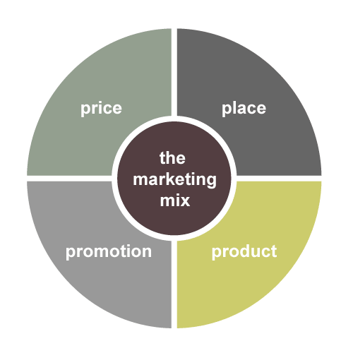
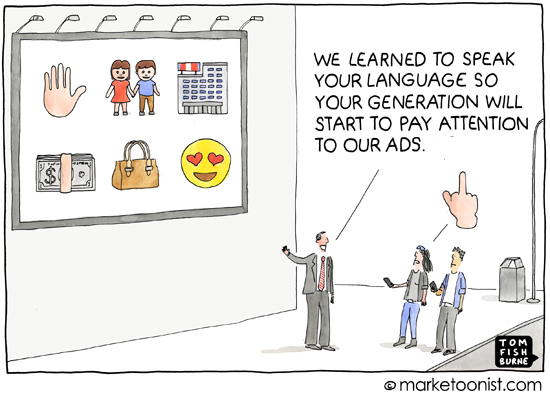
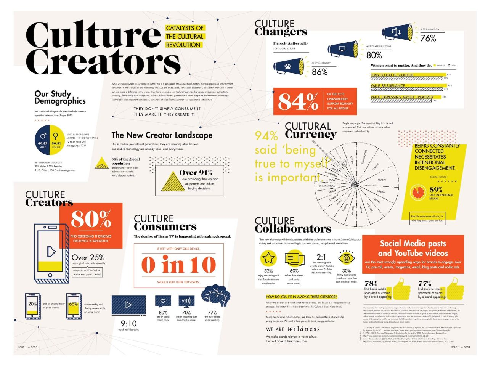
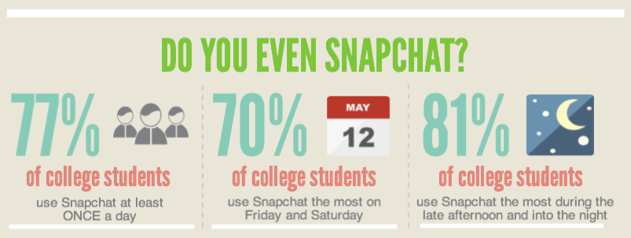

It was a simpler time when I was back in the uni studying marketing. The holy grail of marketing mix boiled down to 4Ps; product, price, promotion and place. The objective was pretty much akin to how you would try to fulfil the needs of your sims in The Sims. Keep all bars to the full, keep wooing your target audience by constantly talking and soon enough, you’ll get your WooHoo moment.

A lot changed since 4P was introduced. As the marketing had a paradigm shift from talking about the product to telling a story, so did the consumer behaviour. The formula of 4P was later expanded into 7P with three additional elements; people, process and proof. How they manage to find appropriate Ps to maintain the consistency is still beyond me! This expansion was the old school marketing theory’s attempt at adapting the intangibles, mostly in the forms of services rather than physical products.

The 7Ps of marketing mix was often seen as a driver of growth, while giving a brand fundamental pointers for assessing its growth strategy. And in many ways, it can still be a powerful tool for contemporary brands. There is, however, a growing force that render this traditional school of marketing significantly insufficient: Digital media and a Generation Z that is born into it.

The explosion of the internet as a communication tool has fundamentally disrupted the way people keep in touch with each other. And especially for millennials who are born into this expansive platform of constant connection, there were ramifications of this perpetual access to information. Digital communication technologies are transforming the consumer behaviour for the better. Today, consumers are more conscious of what they are buying into, with an infallible attention to identify what’s real and what’s not.

The heightened consciousness of the consumer represent a significant problem for the 7Ps of marketing. The concept of traditional marketing has mainly focused on developing brands and products that nurture customers in a singular dimension of ‘now’. All the attempts at growth hacking aimed at promoting features and personality traits that catered to well being of consumers primarily for the present time.

However, the enlightened customer demand proof of not only where a product/service is coming from, but also how it is going to contribute into society, culture and environment. Considering concurrent marketing mix that consists of 7 elements to support a brand’s existence at the moment, this new breadth of marketing philosophy require new elements that emphasise on the multi-dimensionality of a brand and its products/services.

[Faisal Hoque](https://www.fastcompany.com/3053002/hit-the-ground-running/the-three-new-rules-of-growth-hacking), an entrepreneur and author of ‘Everything Connects: How to Transform and Lead in the Age of Creativity, Innovation, and Sustainability’; suggest three new elements to the marketing mix that might help brands cater to the demands of the shifted consumer behaviour.

## Purpose
The modern marketing thinking, with gained support from digital media, prioritise story telling as the primary go-to market strategy. The purpose of a brand builds up on that idea, fuelled by the consumer consciousness, to reflect on what goes into building products/services (literally) and how they will influence the society.

The involvement of consumers in the conscious decision making process can put pressure on the brands, given that a simple mistake can break the entire customer trust. However, the increased attention of the consumers on the purpose of a brand can also provide a great opportunity for brands, given that they adhere to their purpose and customers’ expectations with no foul play involved.

A brand can cultivate a loyal following if they can formulate their marketing decisions around a purpose-built approach, where consistency of their marketing messages is reflected on what’s being delivered.

## Personality

Up until the revolution of social media, one of the biggest shortcomings of the Internet was the lack of personal touch with regards to brands. The inception of social networking platforms created a boom of opportunities to humanise the Internet experience and made it easier for consumers to reconnect with once-distant brands online.

Brand personalities, of course, is not a brand new phenomena. Celebrity endorsements have been a powerful tool for brands in the past to relate their personas to celebrities with the hopes of attracting their fans and promoting a certain lifestyle. In the digital marketing world, however, the power of personality as a marketing tool is even more prominent.

The advanced targeting features of online advertising helps brands target their target audiences very carefully. So for instance, fans of Roger Federer are more likely to be exposed to [promotions about Rolex](https://www.youtube.com/watch?v=Cb9Z_5sx3F8). as they characteristically display the features and lifestyles of what Rolex wants to reach as their target audience.

## Picture

Studies show that the Generation Z has an attention span of only [8-seconds](http://www.bloombergview.com/articles/2014-06-18/nailing-generation-z). This short attention span, unfortunately, doesn’t benefit anything on digital media that involves actually reading. In the brand new social media of emojis and snaps, visual multimedia is becoming the preferred method of quick communication. No wonder why the active user numbers for both Instagram and Snapchat have been breaking records whereas Twitter has seen a significant drop in growth.

Naturally, the growing trend of visual communication is also reshaping the marketing. The social media messages are becoming more visual, more imagery. To quote Faisal Hoque;

> “The power of pictures, not taglines, is going to be a key battleground in the fight for consumers’ perceptions.”

You can buy Faisal Hoque’s book [‘Everything Connects: How to Transform and Lead in the Age of Creativity, Innovation, and Sustainability’](https://amzn.to/222CYHH).