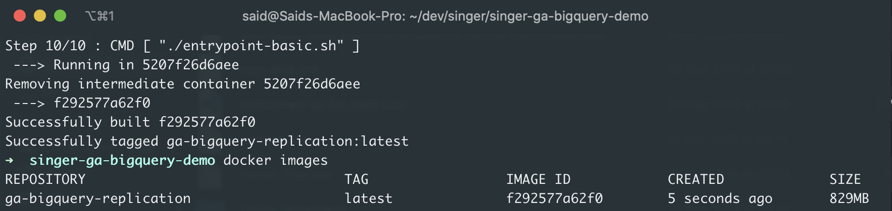
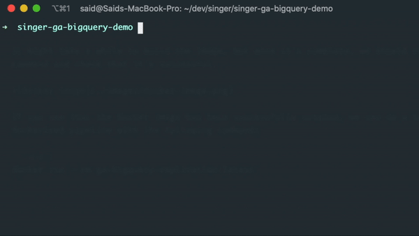

This is a three-part guide on how to replicate Google Analytics data on Google BigQuery, using [singer.io](https://singer.io)'s taps and targets that helps orchestrate the replication process.

### Tools Used

- [Singer.io](https://github.com/singer-io): Open source replication framework
- [Google Analytics Tap](https://github.com/saidtezel/tap-google-analytics): Python package to extract GA data
- [Google BigQuery Target](https://github.com/saidtezel/target-google-bigquery): Python package to load data into BigQuery

### Table of Contents

- Setting up local environment ([Part 1](/ga-bigquery-replication-part-1))
- Dockerising the setup ** (This guide) **
- Setting up replication schedule on Kubernetes (Coming soon)

---

In the part 1 of this tutorial, we have set up our pipeline to run locally and replicate our Google Analytics data into a BigQuery dataset.

This part will focus on dockerising the replication process so that we can easily run or deploy it as a containerised application.

So far, we should have the following folders/files in our project dir:

```bash
# Project dir
├── env-tap
├── env-target
├── tap-config.json
├── target-config.json
├── service-account.json
└── reports.json

```

## Setting Up a Storage Space for State File

One of the main considerations while dockerising this pipeline is that, by default, Docker containers are stateless. This means that if we want to utilise the `state.json` file to log checkpoints between container runs, we can't store the updated file inside an image to be reused in the next run.

This problem creates a need for a persistent storage to store our `state.json` file. This way:
- Container fetches the latest state from storage.
- When it's done running, it stores the latest state in the storage.
- Rinse and repeat.

For this purpose, I utilise [Google Cloud Storage](https://cloud.google.com/storage/) to store my `state.json` file. I will use the Service Account I've created previously to access the storage bucket as well.

Before moving on to writing a Dockerfile, we first write a shell script to faciliate the `state.json` file syncing between the container and the Cloud Storage. Create an `entrypoint.sh` file in the project root with the following content.

```shell
# entrypoint.sh
---

#!/bin/sh

export GOOGLE_APPLICATION_CREDENTIALS=$PWD/service-account.json
export STORAGE_BUCKET=gs://{{YOUR_BUCKET_NAME}}

gcloud auth activate-service-account --key-file=$GOOGLE_APPLICATION_CREDENTIALS

STATE=""

# Attempt to download state.json from Google Cloud Storage. If it exists, pass it into the tap as an argument.
gsutil cp $STORAGE_BUCKET/state.json .
if [ -e state.json ]; then
  STATE="--state state.json"
fi

# Create a temp file to hold the state data
OUTPUT=$(mktemp)

# Run the main function for Singer pipeline, writing the output to the temp file
env-tap/bin/tap-google-analytics --config tap-config.json $STATE | env-target/bin/target-bigquery --config target-config.json | tee $OUTPUT

# If the replication was successful, write/update the temp file to Google Cloud Storage
if [ $? -eq 0 ]; then
  # Writes the function output to a temp file in storage
  tail -1 $OUTPUT > state.json.tmp

  # Prettifies the JSON file and discards the output
  python -mjson.tool state.json.tmp  > /dev/null

  if [ $? -eq 0 ]; then
    gsutil cp state.json.tmp $STORAGE_BUCKET/state.json
    rm state.json.tmp
    rm state.json
  else
    echo "Not updating state.json. Invalid JSON"
    exit 1
  fi
else
  echo "Not updating state.json due to error."
  exit 1
fi
```

You will also need to create an empty bucket on Google Cloud Storage. Once you create a bucket with a unique name, replace `{{YOUR_BUCKET_NAME}}` inside `entrypoint.sh` with your unique bucket name:

```shell
export STORAGE_BUCKET=gs://{{YOUR_BUCKET_NAME}}
```

## Creating a Dockerfile

Now that we have our script to take care of fetching/updating the state file, we will now go ahead and create our Dockerfile inside the project directory.

```dockerfile
# Dockerfile
---

FROM python:3.8-slim
RUN apt-get update && \
    apt-get install -y git gcc curl && \
    rm -rf /var/lib/apt/lists/*

RUN curl -sSL https://sdk.cloud.google.com | bash
ENV PATH="$PATH:/root/google-cloud-sdk/bin"


# Change the container directory and copy all the files here.
WORKDIR /singer
COPY . .

# Install tap/target packages in their respective virtual environments
RUN python -m venv env-tap && env-tap/bin/pip install git+https://github.com/saidtezel/tap-google-analytics.git --no-cache-dir
RUN python -m venv env-target && env-target/bin/pip install git+https://github.com/saidtezel/target-google-bigquery.git --no-cache-dir

RUN chmod u+x entrypoint.sh
CMD [ "./entrypoint.sh" ]
```

When built, this Dockerfile will:
- Download a Python 3.8 image
- Install Google Cloud SDK (for storage access)
- Copy the project files into the image
- Install our tap and target into their own virtualenvs
- Run the `entrypoint.sh` file, which also runs the pipeline and stores the `state.json` file.

We can now build the Docker image with the following command.

```shell
docker build -t ga-bigquery-replication:latest .
```

It might take a while to build the image, but once it's complete, we should run the `docker images` command and check that it's successful.



If you see that the Docker image has been successfully created, we can do a test run of the now dockerised pipeline with the following command:

```shell
docker run --rm ga-bigquery-replication:latest
```



If everything goes according to the plan, running the container will sync the data to BigQuery, create an up-to-date `state.json` file at the end of the run, and upload that file to our Google Cloud Storage bucket for persistent storage.

In this context, re-running the container with the same command will no longer sync the date from the `start_date` we definied within `tap-config.json`, but instead will rely on the latest sync date from `state.json`, which would be today.

## Next Steps

In the third and last part of this tutorial, we will look into how we can utilise the dockerised pipeline to develop an automation in a simple Kubernetes cluster.